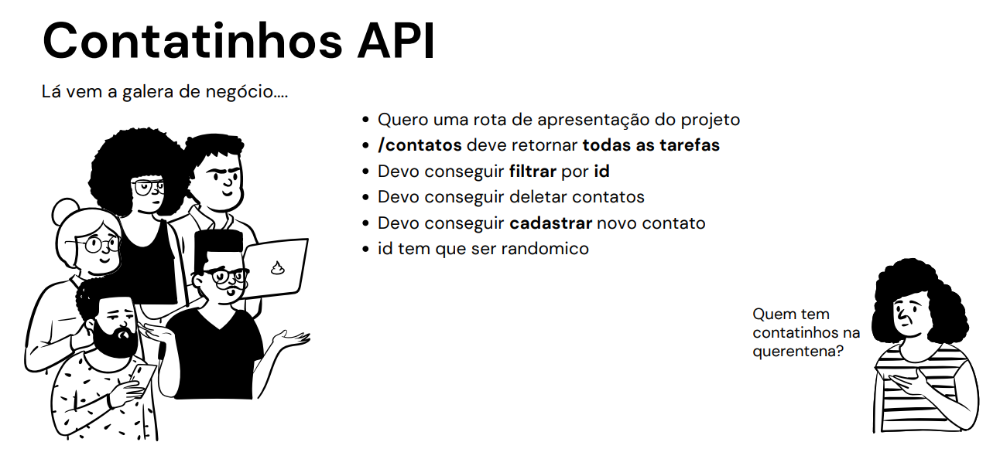
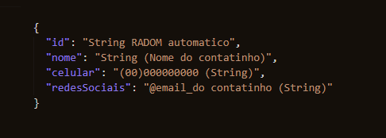

#  📁 __*Documentação*__

 ### O que foi pedido pelo cliente.
 

## __*Rotas*__ 

### [GET] "/"  
Retorna a apresentação do projeto :open_file_folder:
### [GET] "/contatos" 
Retorna todos os contatos cadastrados;
### [GET] "/contatos/:id" 
Retorna um conatao por ID;
 

### [DELETE] "/contatos/:id" 
Detela um contato;
 

### [POST] "/contatos/cadastrar" 
Cadastrar um contato na lista.
 

### Deverá ser enviado pelo Body no seguinte formato:

